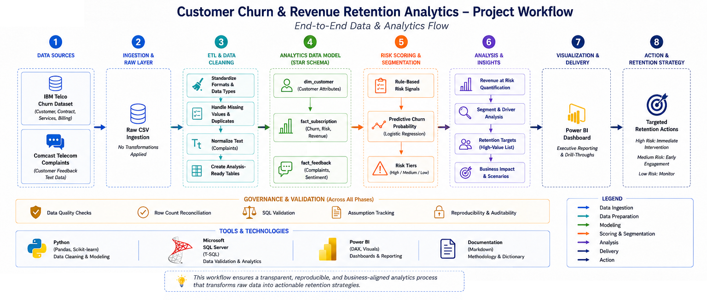
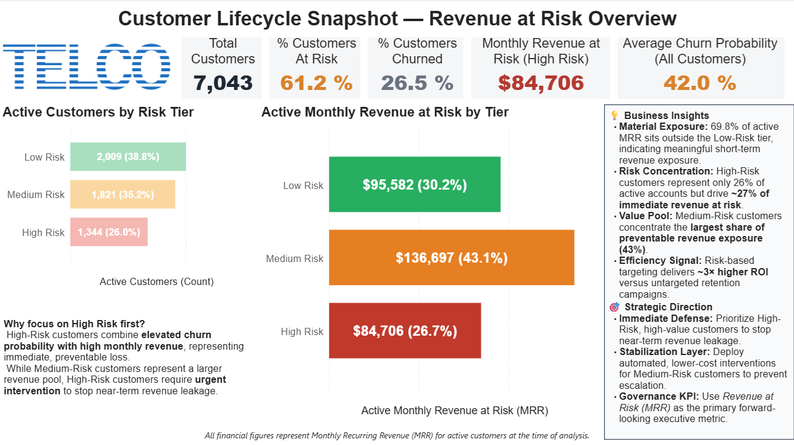
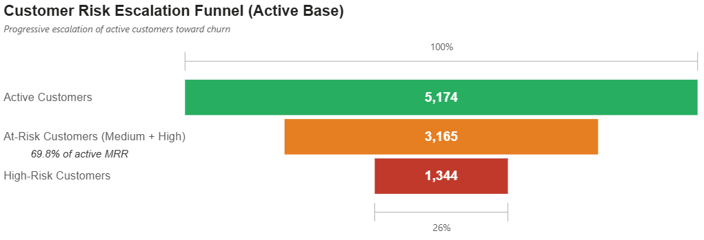
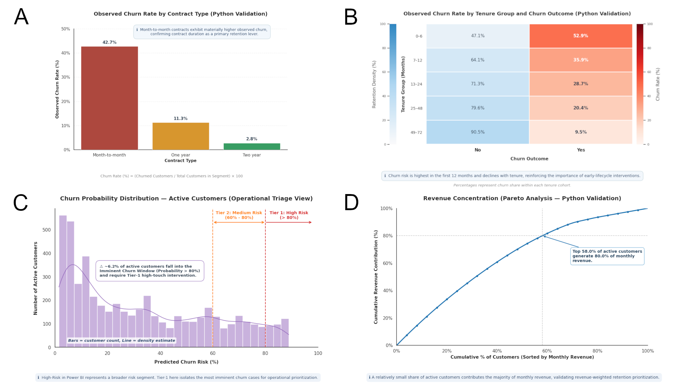
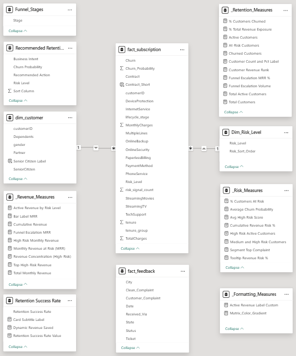

# Customer Churn & Revenue Retention Analytics
**Telecommunications | Subscription Revenue Risk & Retention Prioritization**

---

## Executive Summary
Customer churn is not merely a customer behavior problem — it is a **revenue risk problem**.

This project quantifies **monthly recurring revenue (MRR) at risk**, identifies
where revenue exposure is structurally concentrated, and delivers a
**decision-ready framework for revenue-weighted retention prioritization**.

Rather than relying on opaque black-box predictions, the analysis emphasizes
**interpretability, validation, and executive usability**, enabling leaders to
understand *why* revenue is at risk and *where* intervention produces the
highest financial return.

---

## Business Problem
Executives often recognize churn exists, but lack clarity on:
- How much revenue is actively exposed
- Whether revenue risk is evenly distributed or structurally concentrated
- Which customers should be prioritized to protect financial outcomes efficiently

This project addresses those gaps by combining **churn likelihood** with
**revenue impact**, transforming churn analytics into a financial decision tool.

---

## Solution Overview


**Executive Legend**  
This workflow illustrates how raw subscription data is transformed into
decision-ready churn and revenue insights, ensuring analytical rigor,
traceability, and alignment with executive decision-making.

---

## Methodology
1. **Business Framing & KPI Definition**  
   Monthly Recurring Revenue (MRR), revenue at risk, churn probability thresholds
2. **Data Audit & ETL Pipeline**  
   Raw → Staging → Analytics-ready tables
3. **Lifecycle Segmentation**  
   Active → At-Risk → Churned customer funnel
4. **Predictive Risk Scoring (Python)**  
   Interpretable churn probability modeling
5. **Revenue Concentration Validation**  
   Pareto analysis of active customer revenue
6. **Executive Dashboard Synthesis (Power BI)**  
   Financial exposure and retention prioritization

All assumptions, transformations, and validation logic are documented in `/docs`.

---

## ✔ Reproducibility Checklist
- [x] Public data sources referenced
- [x] Raw data excluded from version control
- [x] Transformations fully documented
- [x] Analytical outputs reproducible from code
- [x] Validation queries provided

---

## Reproducibility & Data Handling
This repository follows analytics and data engineering best practices to ensure
clarity, reproducibility, and responsible data handling.

- **Raw source data** (`data/raw/`) is intentionally excluded from version control.
  These files originate from public datasets and are referenced for structure only.
- **Processed analytical tables** (`data/processed/`) are reproducible artifacts
  generated through documented SQL transformations and Python notebooks.
- All business logic, transformations, and validation steps are fully versioned
  and auditable within this repository.

To reproduce the analysis:
1. Download the referenced public datasets
2. Execute the SQL scripts in `/sql/`
3. Run the Python notebook in `/notebooks/`

This approach ensures results remain **transparent, reproducible, and
enterprise-aligned** without distributing static data artifacts.

---

## Power BI Executive Dashboard


**Executive Legend**  
This dashboard highlights where **revenue exposure is concentrated**, enabling
leaders to identify high-value customers whose churn would have the greatest
financial impact.

---

## Risk Prioritization Framework


**Executive Legend**  
Customers are evaluated across two dimensions:
- Likelihood of churn
- Revenue impact if churn occurs

This prevents low-value churn from distracting retention efforts while ensuring
financially material exposure receives immediate attention.

---

## Python Validation & Revenue Concentration Analysis


**Executive Legend**
- **Visual A:** Month-to-month contracts exhibit materially higher observed churn
- **Visual B:** Churn risk is highest in early tenure and declines with retention
- **Visual C:** Tier-1 thresholds isolate the most imminent churn cases (>80%)
- **Visual D:** Revenue is structurally concentrated among a minority of customers

These validations confirm *where* revenue is concentrated **before** applying
churn probability and *which* customers warrant proactive intervention.

---

## Data Architecture


**Executive Legend**  
A star schema enforces metric consistency across SQL, Python, and Power BI while
supporting scalable, auditable, governance-ready analytics.

---

## Advanced SQL Design Choices

### CTE-Based Analytical Pattern vs. Traditional Subqueries
This project structurally prioritizes **CTEs over nested subqueries** to improve
readability, auditability, and long-term maintainability. Side-by-side production
examples demonstrate how complex logic is decomposed into transparent layers.

Below are two core production examples demonstrating how complex logic was optimized for readability and scaling:

#### Pattern 1: Portfolio Revenue Exposure & Concentration Calculations
* **Business Scenario:** Calculate total monthly revenue exposure for active accounts across risk tiers alongside each tier's percentage share of the total active baseline portfolio.

<table>
<tr>
<th width="50%">❌ Nested Subquery Pattern (Reduced Maintainability)</th>
<th width="50%">✅ CTE Approach (Adopted Production Standard)</th>
</tr>
<tr>
<td valign="top">

```sql
SELECT
    Sub.Risk_Level,
    Sub.Customer_Count,
    Sub.Monthly_Revenue_At_Risk,
    CAST((Sub.Monthly_Revenue_At_Risk * 100.0 / Total.Global_Active_Revenue) AS DECIMAL(10,2)) AS Revenue_Share_Pct
FROM 
    (
        SELECT
            Risk_Level,
            COUNT(*) AS Customer_Count,
            SUM(MonthlyCharges) AS Monthly_Revenue_At_Risk
        FROM dbo.fact_subscription
        WHERE lifecycle_stage = 'Active'
          AND Risk_Level <> 'Churned'
        GROUP BY Risk_Level
    ) AS Sub
CROSS JOIN 
    (
        SELECT SUM(MonthlyCharges) AS Global_Active_Revenue
        FROM dbo.fact_subscription
        WHERE lifecycle_stage = 'Active'
          AND Risk_Level <> 'Churned'
    ) AS Total
ORDER BY 
    CASE Sub.Risk_Level
        WHEN 'High Risk'   THEN 1
        WHEN 'Medium Risk' THEN 2
        ELSE 3
    END;
```
</td>
    <td valign="top"> 

```sql
WITH TargetSegments AS (
    SELECT
        Risk_Level,
        COUNT(*) AS Customer_Count,
        SUM(MonthlyCharges) AS Monthly_Revenue_At_Risk
    FROM dbo.fact_subscription
    WHERE lifecycle_stage = 'Active'
      AND Risk_Level <> 'Churned'
    GROUP BY Risk_Level
),
GlobalBenchmark AS (
    SELECT SUM(Monthly_Revenue_At_Risk) AS Total_Active_Revenue
    FROM TargetSegments
)
SELECT
    TS.Risk_Level,
    TS.Customer_Count,
    CAST(TS.Monthly_Revenue_At_Risk AS DECIMAL(12,2)) AS Monthly_Revenue_At_Risk,
    CAST((TS.Monthly_Revenue_At_Risk * 100.0 / GB.Total_Active_Revenue) AS DECIMAL(10,2)) AS Revenue_Share_Pct
FROM TargetSegments AS TS
CROSS JOIN GlobalBenchmark AS GB
ORDER BY 
    CASE TS.Risk_Level
        WHEN 'High Risk'   THEN 1
        WHEN 'Medium Risk' THEN 2
        ELSE 3
    END;
```
</td>
  </tr>
</table>

#### Pattern 2: Demographics × High-Risk Cross-Functional Targeting
* **Business Scenario:** Isolate high-value Senior Citizen profiles whose monthly bill exposure exceeds the overall fleet average, matching them with model-derived risk data.

<table>
<tr>
<th width="50%">❌ Nested Subquery Pattern (Reduced Maintainability)</th>
<th width="50%">✅ CTE Approach (Adopted Production Standard)</th>
</tr>
<tr>
<td valign="top">

```sql
SELECT 
    C.customerID,
    C.SeniorCitizen,
    HighRiskSubs.MonthlyCharges,
    HighRiskSubs.Churn_Probability
FROM dbo.dim_customer AS C
JOIN 
    (
        SELECT 
            customerID, 
            MonthlyCharges, 
            Churn_Probability
        FROM dbo.fact_subscription
        WHERE lifecycle_stage = 'Active'
          AND Risk_Level = 'High Risk'
          AND MonthlyCharges > (SELECT AVG(MonthlyCharges) FROM dbo.fact_subscription)
    ) AS HighRiskSubs ON C.customerID = HighRiskSubs.customerID
WHERE C.SeniorCitizen = 1
ORDER BY HighRiskSubs.MonthlyCharges DESC;
```
</td>
    <td valign="top"> 

```sql
WITH PortfolioBenchmarks AS (
    SELECT AVG(MonthlyCharges) AS Avg_Monthly_Bill
    FROM dbo.fact_subscription -- Portfolio-wide benchmark across all customers
),
HighValueHighRisk AS (
    SELECT 
        customerID,
        MonthlyCharges,
        Churn_Probability
    FROM dbo.fact_subscription
    CROSS JOIN PortfolioBenchmarks
    WHERE lifecycle_stage = 'Active'
      AND Risk_Level = 'High Risk'
      AND MonthlyCharges > Avg_Monthly_Bill
)
SELECT
    C.customerID AS Customer_ID,
    CASE C.SeniorCitizen WHEN 1 THEN 'Senior' ELSE 'Non-Senior' END AS Demographic_Group,
    CAST(H.MonthlyCharges AS DECIMAL(12,2)) AS Monthly_Bill,
    CAST(H.Churn_Probability * 100 AS DECIMAL(10,2)) AS Risk_Score_Pct
FROM dbo.dim_customer AS C
JOIN HighValueHighRisk AS H ON C.customerID = H.customerID
WHERE C.SeniorCitizen = 1
ORDER BY Monthly_Bill DESC;
```
</td>
  </tr>
</table>

### Why CTEs were chosen
- Enforces a clear, top-to-bottom analytical narrative aligned with business logic
- Eliminates duplicated filtering and benchmark calculations
- Simplifies debugging, peer review, and audit validation
- Improves long-term maintainability as analytical requirements evolve
- Enables safe reuse of intermediate metrics across downstream analyses

---

## Key Results
- Quantified monthly revenue exposure tied to churn risk
- Identified early-tenure and contract-structure churn drivers
- Demonstrated structural revenue concentration
- Delivered a financially prioritized retention framework

---

## Business Recommendations
- Prioritize **high-revenue customers early in the risk curve**
- Reinforce onboarding during the first 6–12 months
- Incentivize longer-term contracts
- Allocate retention resources based on **financial impact**, not volume

---

## Executive Decision Memo
Executive-level decisions and tradeoffs are documented in:
docs/business_decisions.md

---

## Analytical Transparency
Representative SQL queries and outputs validating key conclusions:
docs/sample_query_results.md

---
## Data Sources

All raw datasets used in this analysis are **publicly available third-party sources**
and are **not redistributed** in this repository.

This project emphasizes **analytical methodology, reproducibility, and decision
framework design**, rather than data hosting.

- **IBM Telco Customer Churn Dataset**  
  Source: https://www.kaggle.com/datasets/blastchar/telco-customer-churn  
  Referenced file name: data/raw/WA_Fn-UseC_-Telco-Customer-Churn.csv

- **Comcast Telecom Consumer Complaints Dataset**  
  Source: https://www.kaggle.com/datasets/pandanup/comcast-telecom-consumer-complaints  
  Referenced file name: data/raw/Comcast_telecom_complaints_data.csv

---

## Next Steps (Out of Scope)
- Uplift and treatment effect modeling
- Campaign response tracking
- Customer lifetime value (CLV) integration
- Automated retention recommendation
